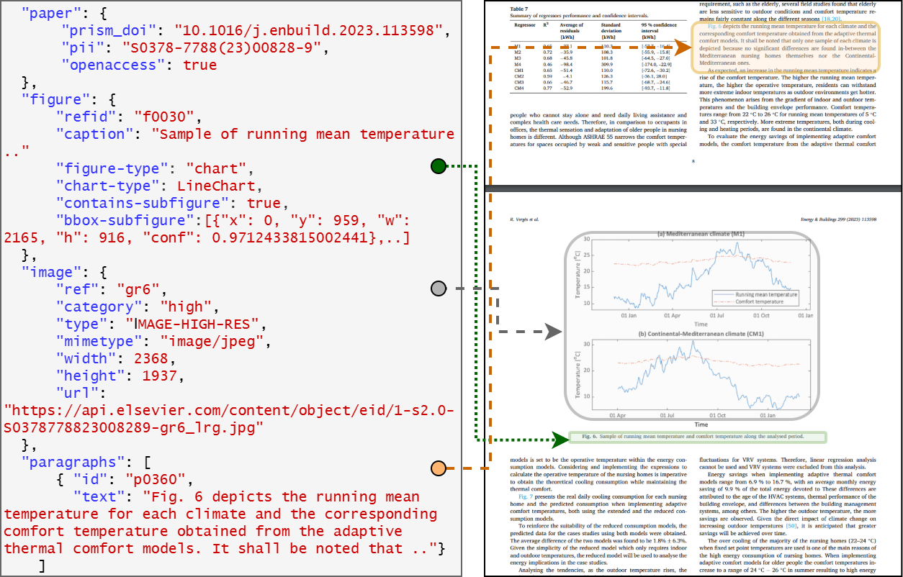

# ElsCap
We created the ElsCap dataset, meticulously compiled from a vast collection of open-access scientific articles on the ScienceDirect platform, a comprehensive repository of peer-reviewed academic literature managed by Elsevier.

## Project Structure

ELSCAP/
│
├── data/                  # Folder where the images will be saved.
|  ├── imgs/               # Folder for the images
|  ├── info/               # Folder for downloaded JSON files
│
├── main.py                # Entry point (orchestrates the process)
├── downloader_info.py     # Logic for downloading from Google Drive
├── processor.py           # Logic for reading JSONs, extracting URLs from images, and downloading them.
│
├── requirements.txt       # Required libraries (gdown, requests)
└── README.md              # Project documentation


- `main.py`: Entry point with a Command Line Interface (CLI).
- `downloader_info.py`: Manages Google Drive downloads and ZIP extraction.
- `processor.py`: Parses JSON metadata and handles image downloads via API.
- `data/`: Destination directory for organized downloaded images.

## JSON Metadata Structure

The script processes metadata extracted from scientific articles. The following image describes the data hierarchy:



Key fields processed include:
- **Paper**: DOI and PII identifiers.
- **Figure**: Captions and figure types.
- **Image**: High-resolution URL for asset retrieval.
- **Paragraphs**: Contextual text surrounding figure citations.

## 🚀 Getting Started

### Prerequisites
Ensure you have the required libraries installed:
```bash
pip install gdown requests
```